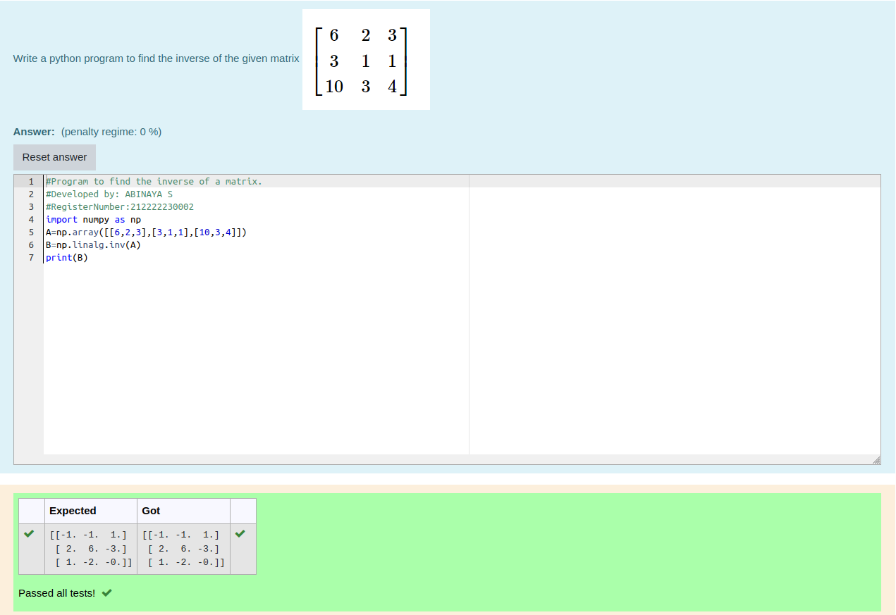

# INVERSE-OF-A-MATRIX
## Aim:
To write a python program to find the inverse of a matrix
## Equipment’s required:
1. 	Hardware – PCs
2. 	Anaconda – Python 3.7 Installation / Moodle-Code Runner
## Algorithm:
### Step1 : 
Import numpy as np
### Step 2: 
Initialize the matrix using np.array
### Step 3: 
Calculate the rank of the matrix using np.linalg.rank
### Step 4: 
Print the result
## Program:
```
#Program to find the inverse of a matrix.
#Developed by: ABINAYA S
#RegisterNumber:212222230002
import numpy as np
A=np.array([[6,2,3],[3,1,1],[10,3,4]])
B=np.linalg.inv(A)
print(B)
```
## Output:

## Result:
Thus the inverse of given matrix is successfully solved using python program

